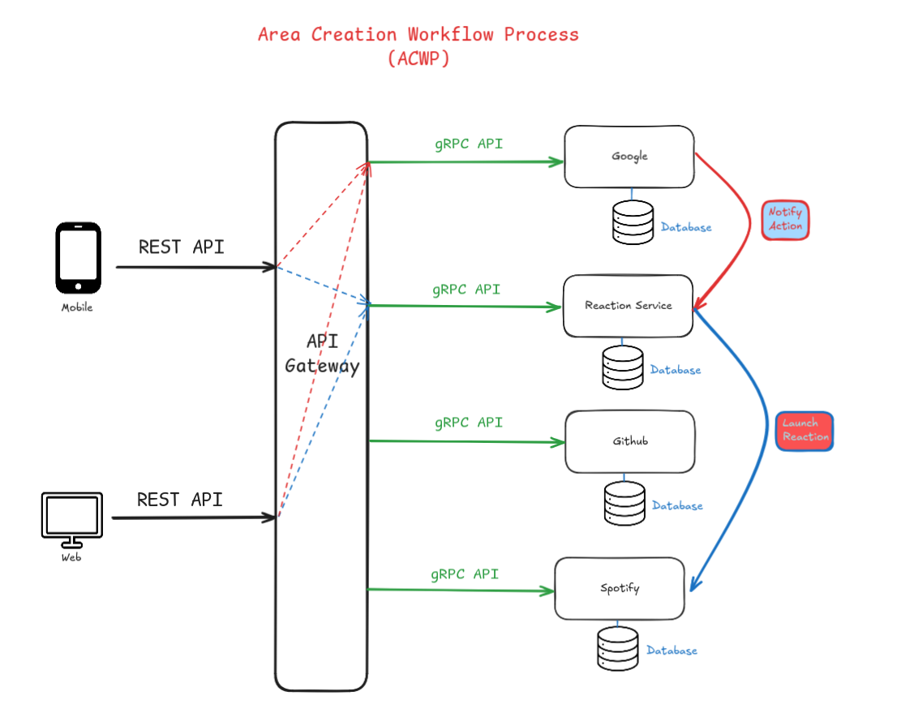
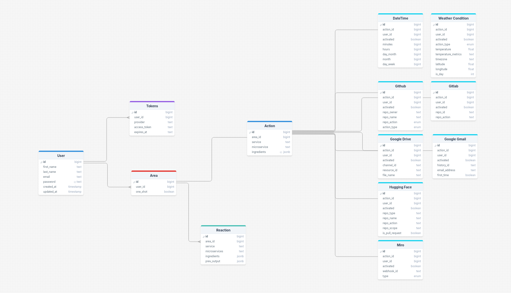

# Developer Documentation

## Table Of Contents
1. [Introduction](#introduction)
2. [Technical Stack](#technical-stack)
3. [Backend Architecture](#backend-architecture)
	1. [Microservices Diagram](#microservices-diagram)
	2. [Database Schema](#database-schema)
	3. [File architecture](#file-architecture)
4. [Tutorials (How to)](#tutorials-how-to)
	1. [Install Dependencies](#install-dependencies)
		* [Docker](#docker)
		* [Golang](#golang)
		* [gRPC](#gRPC)
	2. [Generate protogen files](#generate-protogen-files)
	3. [Create a new service in the server](#create-a-new-service-in-the-server)
		* [Proto File](#proto-file)
		* [Create the file architecture](#create-the-file-architecture)
		* [Service Client and Server](#service-Client-and-Server)
		* [Link to the core of Area](#link-to-the-core-of-Area)
		* [OAuth](#OAuth)
	4. [Implement a new Action (or Reaction) for a service](#Implement-a-new-Action-or-Reaction-for-a-service)
		* [Create a new action (or reaction)](#Create-a-new-action-or-reaction)
		* [Handle the actions](#handle-the-actions)
	5. [Inform the front for the new Area](#Inform-the-front-for-the-new-Area)
	6. [Activate (or Deactivate) an Area](#Activate-or-Deactivate-an-Area)
	7. [View Database](#view-database)
	8. [Use Swagger](#use-swagger)
	9. [Troubleshooting](#troubleshooting)

# Introduction

Welcome to our project's developer documentation. This comprehensive guide is designed to onboard new developers quickly and effectively by providing a clear overview of our project's structure and core components. Rather than getting lost in code details, we focus on giving you the big picture - helping you understand our architecture, key systems, and development practices. Whether you're a new team member or contributing to the project, this guide will help you navigate our development environment with confidence.

# Technical Stack

**Backend**: We decided to choose Golang, with [go-chi](https://go-chi.io/#/) for the API Gateway and [go-gRPC](https://grpc.io/) for the microservices.

**Web**: We decided to choose NextJS, because it is based on ReactJS with a pro-efficient community and for his efficiency.

**Mobile**: We decided to choose Flutter, because it is really high level and easy to understand and to use.

If you need details about the technical stack we used you can go to the Technical and Comparative Study document we made (LINK HERE).

# Backend Architecture

This section include all the diagrams we us we made to understand the backend architecture, microservices, database or even golang file architecture.

## Microservices Diagram



This diagram shows the Area Creation Workflow Process (ACWP), which illustrates a microservices architecture with the following components:

- A mobile app and web interface that communicate with the system through REST APIs
- An API Gateway that acts as the central entry point, receiving REST API requests and routing them to appropriate services
- Four microservices (Google, Reaction Service, Github, and Spotify) that communicate with the API Gateway using gRPC APIs
- Two types of actions are shown:
    - "Notify Action" (red path) which connects Google to the Reaction Service
    - "Launch Reaction" (blue path) which connects the Reaction Service to Spotify

The architecture follows a modern microservices pattern where the API Gateway decouples the clients (mobile and web) from the underlying services, allowing for better scalability and maintenance.

## Database Schema



The database schema illustrates a service integration platform with:

- Core components: User, Tokens, Area, Action, and Reaction tables
- Service integrations: DateTime, Weather, Github, Google services, Hugging Face, and Miro
- Each service table contains standard fields (id, user_id, activated) plus service-specific attributes

## File architecture

Here you can see a simplified version of the file architecture of the repository:

```bash
area/
└── server/ # Golang server is here
    ├── api/ # All the gateway is define there
    │   ├── routes/ # All the routes of the gateway with go-chi
    │   ├── middleware/ # Middlewares for the router
    │   └── controllers/ # Controllers of the routes
    ├── gRPC/ # gRPC API
    │   ├── api/ # All the gRPC services
    │   │   ├── google/
    │   │   ├── github/
    │   │   ├── .......
    │   │   └── hugging_face/
    │   ├── proto/ # Proto files defining a service
    │   └── grpc_routes/ # gRPC router
    ├── protogen/ # Golang files generated from .proto files
    └── db/ # Database methods
```

# Tutorials (How to)

Here are some tutorials on how to do certain things to be ready to dev new features in our marvelous Area !

## Install Dependencies

### Docker

You can use docker to test the app.

To launch the app:

```bash
docker compose up -d
```

To stop the app:

```bash
docker compose down
```

### Golang

The server is made in Go so first of all make sure you have Go installed !

You can follow this tutorial if it isn’t: [https://go.dev/doc/install](https://go.dev/doc/install) and then being happy for yourself !

### gRPC

First of all you have to install protoc [https://grpc.io/docs/protoc-installation/](https://grpc.io/docs/protoc-installation/).

Then when it is done you have to install the go-grpc:

```bash
go get -u google.golang.org/grpc
```

Don’t forget to do at `server/`:

```bash
go get .
```

Now you have installed gRPC for golang and you are ready to launch the server.

## Generate protogen files

At the root of `server/` directory, simply do:

```bash
protoc --go_out=./protogen --go_opt=paths=source_relative --go-grpc_out=./protogen --go-grpc_opt=paths=source_relative gRPC/proto/*
```

This will generate Golang file from gRPC proto files. If you have problems please look at [Install gRPC](https://www.notion.so/Developer-Documentation-17c2a009765c80ef8057ec3ddf73647b?pvs=21) and install **protoc** and **go-grpc.**

## Create a new service in the server

Suppose you want to contribute to our magnificient project (thanks again 😊) and add a service named `<NAME>`, you have to follow a few steps:

### Proto File

First you have to create a file in `server/gRPC/proto/` and name it  `<NAME>`.proto and have a minimal implementation like this:

```protobuf
syntax = "proto3";

package <NAME>;

option go_package = "github.com/area/grpc-go/service";

service <NAME>Service {
  // TODO <NAME>: Description of the microservice
  rpc Test<NAME>(Test<NAME>Req) returns(Test<NAME>Resp) {}
}

message Test<NAME>Req {
  bool activated = 1;
  int32 action_id = 2;

	string request = 3;
}

message Test<NAME>Resp {
  bool activated = 1;
  int32 action_id = 2;

	string response = 3;
}
```

Then generate the protogen: [Generate protogen](https://www.notion.so/Developer-Documentation-17c2a009765c80ef8057ec3ddf73647b?pvs=21).

You should have the golang implementation of the .proto file in the directory `server/protogen/`.

### Create the file architecture

The file architecture should look like this:

```bash
server/
└── gRPC/
    └── api/
        └── <NAME>/
            ├── <NAME>Client/
            │   └── <NAME>Client.go
		            .... More client files if necessary
            └── <NAME>Server/
                └── <NAME>Service.go
                .... More server files if necessary
```

### Service Client and Server

- Client **MUST** implement this interface

```go
type ClientService interface {
	// List the status of the current service, including the microservice currently supported
	ListServiceStatus() (*ServiceStatus, error)

	// Send an action that a service should watch
	SendAction(body models.AreaScenario, actionId, userID int) (*ActionResponseStatus, error)

	// Deactivate an area
	//
	// Parameter id must be used to identify the area, and userID identifies the user
	SetActivate(microservice string, id uint, userID int, activated bool) (*SetActivatedResponseStatus, error)

	// Trigger a specific reaction of an user
	TriggerReaction(ingredients map[string]any, microservice string, prevOutput []byte, userID int) (*ReactionResponseStatus, error)

	// Trigger the webhook callback sent by a remote service
	TriggerWebhook(webhook *WebhookInfos, microservice string, action_id int) (*WebHookResponseStatus, error)
}
```

- Service **MUST** implement the rpc defined in the .proto, example:

```go
func (serviceName *ServiceName) RpcFunction(ctx context.Context, req *gRPCService.RpcReq) (*gRPCService.RpcResp, error) {
	.... RPC implementation
}
```

**IMPORTANT:** When you implement a new rpc function the context should have stored the JWT for security purpose and should be always checked (except for webhook callback functions).

### Link to the core of Area

You have to add your service in 3 places near the other services:

- The service in the gRPC router (`server/gRPC/grpc_routes/router.go`):
- The client in API Gateway (`server/api/apiGateway.go`)
- The client in Reaction Service (`server/gRPC/api/reaction/reactionService.go`)

### OAuth

If a service requires OAuth2, it should be implemented in the `server/api/controllers/oauth`directory. Create a file named `oauth<NAME>` and follow the interface in the `server/api/controllers/oauth/oauthTypes.go` to create the one adapted to your service.

## Implement a new Action (or Reaction) for a service

### Create a new action (or reaction)

- Add a new rpc function in the proto file of the specified service

```protobuf
// TODO <NAME>: Description of the microservice
rpc NewReaction<NAME>(NewReaction<NAME>Req) returns(NewReaction<NAME>Resp) {}
```

- Implement it in the server side of the service:

```go
func (serviceName *ServiceName) NewReaction<NAME>(ctx context.Context, req *gRPCService.NewReactionReq) (*gRPCService.NewReactionResp, error) {
	.... RPC implementation
}
```

- The gateway will provide to the specific serviceClient the name of the microservice so you should implement a way to link a specific microservice to the following rpc call.

```go
// If the microservice is a reaction:
TriggerReaction(ingredients map[string]any, microservice string, prevOutput []byte, userID int) (*ReactionResponseStatus, error)

// If the microservice is an action
SendAction(body models.AreaScenario, actionId, userID int) (*ActionResponseStatus, error)
```

It all happens in this function, a good way is to have this type of data structure:

 `map[string]{ReactionLauncher or ActionLauncher}` .

(NOTE: the syntax ‘{’ and ‘}’ is incorrect in go and is only for explaining purpose)

**IMPORTANT**: Return important informations for the rpc call as it will be used for area chain.

### Handle the actions

At server side when you receive an action you should store it in a specific database schema, using the library [bun](https://bun.uptrace.dev/) in golang.

- You should specify the new model and the database with his specific methods:

In `server/models/` , create a file with all the datas you want to store:

```go
package models

import "github.com/uptrace/bun"

type <NAME> struct {
	bun.BaseModel `bun:"table:<NAME-DB>,alias:cs"`
	ID            uint `bun:"id,pk,autoincrement" json:"id,pk,autoincrement"`

	ActionID  uint `bun:"action_id" json:"action_id"`
	UserID    uint `bun:"user_id" json:"user_id"`
	Activated bool `bun:"activated" json:"activated,omitempty"`

	// Define the datas you want with the bun and json tags
}
```

In `server/db`, create another file with the methods to interact with this model:

```go
package db

import (
	"area/models"
	"context"

	"github.com/uptrace/bun"
)

type <NAME>DB struct {
	Db *bun.DB
}

func Init<NAME>Db() (*<NAME>DB, error) {
	db := initDB()

	_, err := db.NewCreateTable().
		Model((*models.<NAME>)(nil)).
		IfNotExists().
		Exec(context.Background())

	return &<NAME>{Db: db}, err
}

// All the methods you want for this database model
```

- Handle Cronjob

We use the library [robfig](https://pkg.go.dev/github.com/robfig/cron/v3@v3.0.1) to handle the cron job, here what you need to do is simply store the action in database and activate a cron job every X time. When the cron in triggered you inform the reaction service only if the conditions are required.

- Handle Webhook

When you send a new action webhook, the callback URI is: [`<HOST>/webhook/<SERVICE-NAME>/<MICROSERVICE-NAME>/<ACTION-ID>`](https://5339-2a01-e0a-d58-380-4af8-6516-9400-6fc.ngrok-free.app/webhook/%25s/%25s/%25v) . It will be forwarded to the serviceClient `TriggerWebhook` function:

```go
TriggerWebhook(webhook *WebhookInfos, microservice string, action_id int) (*WebHookResponseStatus, error)
```

So you should forward the webhook call to the following service again with methods like a `map[string]func` or something else to do the rpc call.

**IMPORTANT**: The result payload should be forwarded to a new rpc function created, so when you create an action you should provide an ‘actionCreator’ and a ‘webhookHandler’, and the ‘webhookHandler’ should ignore the context.

**IMPORTANT**: In dev environment use ngrok to create a http tunnel to test the webhooks and modify the host’s callback URI.

## Inform the front for the new Area

When the fronts want to have the status of the current areas he does an API call to the gateway (`/area/create/list`). You have to implement this function to give to the fronts the informations about the new areas:

```go
func (service *<NAME>Client) ListServiceStatus() (*IServ.ServiceStatus, error) {
	status := &IServ.ServiceStatus{
		Name:    "<SERVICE NAME>",
		RefName: "<service ref name>",

		Microservices: []IServ.MicroserviceDescriptor{
			IServ.MicroserviceDescriptor{
				Name:    "Microservice description",
				RefName: "Microservice Name",
				Type:    "action" | "reaction",

				Ingredients: map[string]IServ.IngredientDescriptor{
					"Text": {
						Value:       0,
						Type:        "string",
						Description: "Description of the ingredient",
						Required:    true,
					},
				},
				PipelineAvailable: []string{"output1", "output2"}
			},
		},
	}
	return status, nil
}
```

Implementing this function for the client expose your area to the fronts.

## Activate (or Deactivate) an Area

If you want to deactivate an action you can use the route: `/area/activate` that will deactivate an entire area.

Service side, to disable an action, you should implement:

```go
SetActivate(microservice string, id uint, userID int, activated bool) (*SetActivatedResponseStatus, error) 
```

The API Gateway will forward the arguments of the route to this function, so here you can either delete the action, deactivate it or reactivate it.

## View Database

Install and setup prisma studio:

```bash
mkdir prisma-viewer
cd prisma-viewer

npm install prisma --save-dev
npx prisma init
echo "/Td6WFoAAATm1rRGAgAhARwAAAAQz1jM4AIHAUBdABGIBSi6FlGNBK9chcrHB1AFIzYjO5YyUmEv
3boiwXpdqhlfUIAPle8MFVlIBE/+YSeLUrHDMEdn8vvC9JSTtn4iMeYPAOpPOtii9v1Q5wK47rju
JtUicyVPATokAcQIwIjVFciQ6r9R92b5vZUue7NDgVbVqy4Mps1BJlg75EvmEaMKJFI3FpOxzN2I
K/K26MmdPndqmmKBs5Wo24Q6bYont2yP+khMXcrIZ2NsEVSB/e43zcwxpIdMyDdORaR3RNAHRgbd
G883eSykh99CyjoO0u8JOuxtN/JMWpdB/05uqHR1KQ17glDkhlPd0BGjUhAeilFMq20456P99Rz8
9PEfZzkA5yfFXkJqtgDoYPIW1vMKr0D7PqLBSyMKLwDrTjm6fdLyHkjlyIlCBGjgLNIk+u9lQUsm
XOAHQ+nl/uScAF2f36RGQInEAAHcAogEAADhbY3zscRn+wIAAAAABFla" | base64 -d | xz -d > .env

npx prisma db pull
```

Launch the database viewer:

```bash
npx prisma studio
```

## Use Swagger

For the backend server we use [swaggo](https://github.com/swaggo/swag), to init swaggo you must do, at the root of the `server/` directory:

```bash
swag init -g "api/routes/router.go"  --parseDependency --parseInternal
```

Then you can just you can just start the server and go to the following route:

`<HOST-NAME>:8080/swagger/index.html`

If you need informations about the API routes the swagger is your best friend.

## Troubleshooting

If you have problem, please contact `alexandre1.renaud@epitech.eu`

If he does not respond contact `alexandre.renaud@epitech.eu`

AND if he still does not respond contact: `clery.plassat1@epitech.eu`

Thanks : )