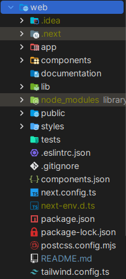

# Getting Started
Jumping right in a project without knowing beforehand its structure and organization can be pretty rough.

So in this part i'm going to try and explain to you the file architecture of our web frontend.




- **app/** : This directory contains all the routes and pages that compose this website. 
Each route is defined by a page.tsx file, which renders the content for that specific URL. 
For example, app/register/page.tsx will display the sign-up page when navigating to /register. 
Additionally, the layout.tsx file allows you to create a consistent layout across multiple pages, wrapping them with shared UI elements like headers and footers. 


- **components/ui/** : This directory contains all the reusable UI components for our Next.js application. 
This structure promotes modularity and consistency across the app by allowing you to create and maintain common elements such as buttons, forms, and modals in one place.


- **public/** : This directory in a Next.js application is designated for storing static assets such as images, fonts, and other files that need to be served directly to the client. 
Any file placed in this directory is accessible from the root URL of our application, simplifying the process of referencing these assets in your code. 
For example, if you have an image located at public/images/logo.png, it can be accessed via /images/logo.png in your components.


## NEXT PART

This is a [Next.js](https://nextjs.org) project bootstrapped with [`create-next-app`](https://nextjs.org/docs/app/api-reference/cli/create-next-app).

First, run the development server:

```bash
npm run dev
# or
yarn dev
# or
pnpm dev
# or
bun dev
```

Open [http://localhost:3000](http://localhost:3000) with your browser to see the result.

You can start editing the page by modifying `app/page.tsx`. The page auto-updates as you edit the file.

This project uses [`next/font`](https://nextjs.org/docs/app/building-your-application/optimizing/fonts) to automatically optimize and load [Geist](https://vercel.com/font), a new font family for Vercel.

## Learn More

To learn more about Next.js, take a look at the following resources:

- [Next.js Documentation](https://nextjs.org/docs) - learn about Next.js features and API.
- [Learn Next.js](https://nextjs.org/learn) - an interactive Next.js tutorial.

You can check out [the Next.js GitHub repository](https://github.com/vercel/next.js) - your feedback and contributions are welcome!
