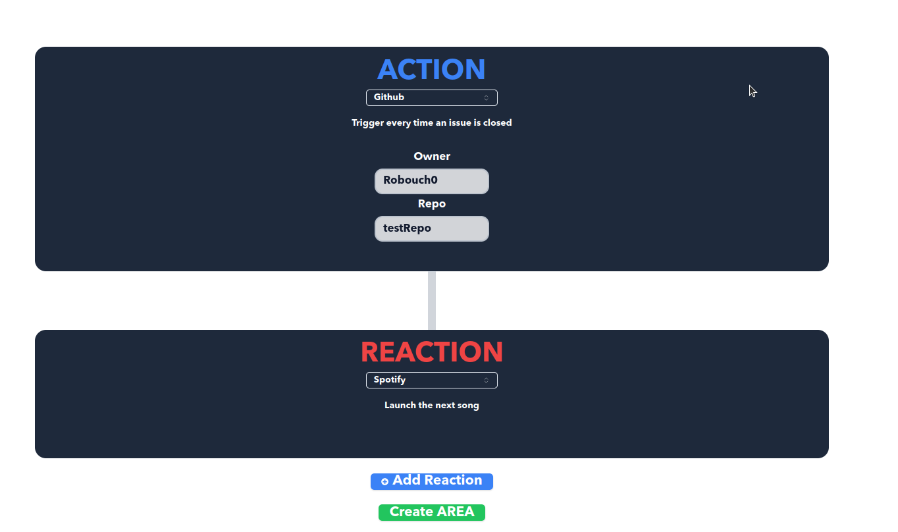

# User Documentation Walkthrough

## Introduction
- **Purpose of the Documentation**: This documentation provides a comprehensive guide to using the website, detailing its features and functionalities.
- **Overview of Features**: The website includes multiple pages: My Area, Profile, Create, Login, and Register.

## 1. My Area Page
### Description
The My Area page allows users to view and manage their created Area Cards.

On each of your Area Card you can see the action and first reaction description.

Aswell as the Category of service his action is coming from (ex: Github)
# Functionalities
## **Search Areas**:

- On this search field you can type the name of the action/reactions or the description of the microservices in this area.

## **Enable/Disable Areas**:

- You can click the switch on the area card to disable or enable them.

## **Delete Areas**:

On this page you can also delete areas you created previously, by clicking on the little trashbin right here.

 

## Visual overview of the My Areas page

---

## 2. Profile Page
### Description

The Profile page enables users to manage their personal information and link external accounts.

### Sections
- **Update User Data**:

- 

    - The left part of the profile page allows user to edit their personnal informations with input fields.
   
    - Write down the new value in the corresponding field, then press the Save & Update Profile to update your datas on Area servers.

- **Link OAuth Accounts**:

  
- The right side of the profile page allows you to scroll through services (e.g., GitHub, Google, Spotify).
- You can click on the Unlink button to make Area forgot about your linked account on the designated service.
- Or press the Link button to connect an external account with Oauth validation.

### Visual overview of the profile page

---

## 3. Create Page
### Description

The Create page allows users to set up automated actions by choosing services and using microservices from them.

On this page you can choose one actions and add multiple reactions to it.

### Functionality
- **Choose Service for Action/Reaction**:

- Here on this screenshot you can see how to search and select a service on the dropdown.

- **Select Microservices**:

- After choosing a service, microservices card with description will be displayed. You can click on them to select one.

- **Fill out the values**:

    - For the area to be created the required fields of the microservices need to be filled.
    - Some fields need texts in it
    - In some that needs time data you can select it in the calendar directly
    - If you need more information about an ingredient you can pass your mouse on it to have a tooltip containing a brief description of what we are waiting for.

*Tooltip description of the ingredient*

- After you filled out everything you can click on the create AREA button to finish the process and create your process automation !

- **Add chained reactions**:

In our website you can create area with one action and then add multiple chained reactions to it.
For this just click on the [**+ Add Reaction**] button 
then fill out the new inputfield needed before creating your area.

- **Data pipelines**:

On some microservices you can also transfer trough small pipe between a precendent microservices some datas :

You can for example use the hour variable of your action date and time in your send mail reaction.

In order to do this first check the available variables at the end of your action/reaction :

And then you can simply use it like this in the next reaction : 

### Visual overview of the Create page

---

## 4. Login Page
### Description
The Login page is where users access their accounts.

### Steps to Log In
- To log-in you can either enter your credentials (email and password).
- Or you can connect with Oauth (Discord, Google, GitHub...)
- If you do not own an Area account for the moment, at the bottom of the page you cand find a link to go to the register page, to create an account.

---

## 5. Register Page
### Description
The Register page allows new users to create an account.

### Steps to Register
- Filling out registration form fields (firstname, lastname, email, password).
- If you want to do a quick sign-up you can click on one of the three bottom buttons to connect through an Oauth of one of your already existing account (Github, Discord or Google)

We will then take your email on this account as a data on your profile.

## Conclusion

This documentation act as a user guide / walkthrough to help you naviguate on our web application.
You can download a pdf version of this documentation in the FAQ page, available in the footer of every page of our app.
